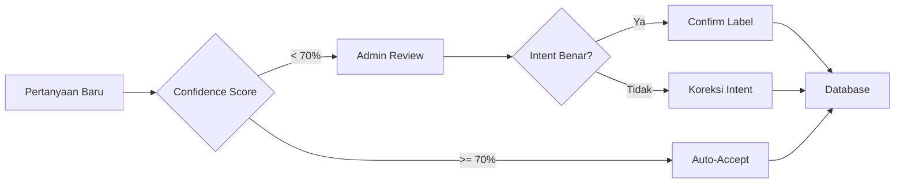

# 📊 Dataset Description - Chatbot PSB

## Deskripsi Dataset

Dataset ini berisi kumpulan pertanyaan untuk melatih model **Intent Classifier** pada Chatbot PSB. Setiap pertanyaan dilabeli dengan intent yang sesuai untuk membantu sistem mengklasifikasikan pertanyaan pengguna secara otomatis.

---

## Sumber Dataset

| Sumber | Deskripsi |
|--------|-----------|
| **User Stories** | Variasi pertanyaan yang disimulasikan berdasarkan skenario calon santri dan wali yang bertanya tentang PSB |
| **FAQ Pesantren** | Pertanyaan umum yang sering diajukan di formulir pendaftaran offline |
| **Analisis Domain** | Pertanyaan yang dikembangkan berdasarkan analisis topik PSB pesantren |

Dataset dikembangkan secara manual dengan fokus pada **variasi bahasa alami** yang digunakan oleh calon santri dan orang tua dalam konteks PSB (Penerimaan Santri Baru).

---

## Struktur Dataset

**File:** `data/intents_v2.csv`

```csv
text,intent
Kapan pendaftaran santri baru dibuka tahun ini?,info_pendaftaran
Apa saja syarat pendaftaran santri?,syarat_pendaftaran
Berapa biaya pendidikan per bulan?,biaya_pendidikan
...
```

| Kolom | Tipe | Deskripsi |
|-------|------|-----------|
| `text` | string | Pertanyaan dari pengguna dalam bahasa Indonesia |
| `intent` | string | Label intent (kategori pertanyaan) |

---

## Statistik Dataset

| Metrik | Nilai |
|--------|-------|
| **Total Entries** | 1.219 |
| **Jumlah Intent** | 10 |
| **Format** | CSV (comma-separated) |
| **Encoding** | UTF-8 |

### Distribusi Intent

| Intent | Jumlah | Persentase |
|--------|--------|------------|
| `faq_umum` | 141 | 11.6% |
| `program_unggulan` | 124 | 10.2% |
| `syarat_pendaftaran` | 122 | 10.0% |
| `kegiatan_harian` | 120 | 9.8% |
| `pendidikan_formal` | 118 | 9.7% |
| `link_formulir` | 117 | 9.6% |
| `info_pendaftaran` | 117 | 9.6% |
| `eskalasi_admin` | 117 | 9.6% |
| `kirim_dokumen` | 114 | 9.4% |
| `biaya_pendidikan` | 119 | 9.8% |

> **Catatan:** Dataset didesain dengan distribusi **relatif seimbang** di sekitar 9-12% per intent.

---

## Deskripsi Intent

| Intent | Deskripsi | Contoh Pertanyaan |
|--------|-----------|-------------------|
| `info_pendaftaran` | Informasi jadwal dan proses pendaftaran | "Kapan pendaftaran santri baru dibuka?" |
| `syarat_pendaftaran` | Syarat dan dokumen yang diperlukan | "Apa saja syarat pendaftaran santri?" |
| `biaya_pendidikan` | Informasi biaya, SPP, dan pembayaran | "Berapa biaya pendidikan per bulan?" |
| `link_formulir` | Akses formulir pendaftaran online | "Dimana link formulir pendaftaran?" |
| `kirim_dokumen` | Cara upload/kirim berkas pendaftaran | "Bagaimana cara upload dokumen?" |
| `kegiatan_harian` | Rutinitas dan jadwal santri | "Bagaimana kegiatan harian santri?" |
| `pendidikan_formal` | Jenjang sekolah formal di pesantren | "Apakah ada SMP atau SMA?" |
| `program_unggulan` | Program khusus pesantren (tahfidz, dll) | "Apa program unggulan pesantren?" |
| `faq_umum` | Pertanyaan umum (lokasi, aturan, fasilitas) | "Apakah santri boleh membawa HP?" |
| `eskalasi_admin` | Request untuk berbicara dengan admin | "Saya ingin bicara dengan admin" |

---

## Contoh Data

### `info_pendaftaran`
```
Kapan pendaftaran santri baru dibuka tahun ini?
Apakah pendaftaran masih dibuka saat ini?
Bagaimana alur pendaftaran santri baru?
```

### `syarat_pendaftaran`
```
Apa saja syarat administrasi pendaftaran santri?
Dokumen apa yang harus disiapkan untuk mendaftar?
Apakah ada batas usia minimal santri?
```

### `biaya_pendidikan`
```
Berapa biaya pendidikan per bulan?
Rincian biaya masuk pesantren apa saja?
Apakah tersedia beasiswa?
```

### `link_formulir`
```
Di mana link formulir pendaftaran?
Tolong kirim formulir pendaftaran online
Apakah ada pendaftaran online?
```

### `eskalasi_admin`
```
Saya ingin bicara dengan admin
Bisa hubungkan saya ke admin?
Mohon nomor WhatsApp admin
```

---

## Proses Labeling

### Alur Labeling Manual



### Tools Pelabelan

| Tool | File | Fungsi |
|------|------|--------|
| **Admin Labeling Tool** | `admin_labeling.py` | Interactive CLI untuk review pertanyaan dengan confidence rendah |
| **Export Training Data** | `export_training_data.py` | Export feedback ke CSV untuk retraining model |

### Workflow Admin Labeling

1. **Review** - Admin menjalankan `python admin_labeling.py`
2. **Filter** - Sistem menampilkan pertanyaan dengan confidence < 70%
3. **Validasi** - Admin memilih:
   - ✓ Intent sudah benar → `helpful`
   - ✗ Intent salah → Pilih intent yang benar
   - ? Tidak yakin → Skip untuk review lanjutan
4. **Export** - Data feedback diekspor ke `data/exports/` untuk retraining

### Kriteria Labeling

- **Konsistensi**: Pertanyaan serupa harus dilabeli dengan intent yang sama
- **Prioritas Konteks**: Fokus pada maksud utama pertanyaan, bukan kata kunci tunggal
- **Edge Cases**: Pertanyaan ambigu ditandai untuk diskusi tim

---

## Feedback Loop

```
┌────────────────────────────────────────────────────────────────┐
│                      FEEDBACK LOOP                             │
├────────────────────────────────────────────────────────────────┤
│  1. User bertanya → Sistem prediksi intent                     │
│  2. Jika confidence rendah → Dicatat di database               │
│  3. Admin review → Koreksi jika perlu                          │
│  4. Export → Training data baru                                │
│  5. Retrain model → Akurasi meningkat                          │
│  6. Repeat                                                     │
└────────────────────────────────────────────────────────────────┘
```

### Database Feedback

| Tabel | Fungsi |
|-------|--------|
| `user_questions` | Menyimpan semua pertanyaan user beserta prediksi intent |
| `intent_feedback` | Menyimpan koreksi admin untuk pertanyaan yang salah/rendah |

---

## Penggunaan Dataset

### Training Model

```python
import pandas as pd
from sklearn.model_selection import train_test_split

# Load dataset
df = pd.read_csv('data/intents_v2.csv')

# Split data
X_train, X_test, y_train, y_test = train_test_split(
    df['text'], df['intent'], 
    test_size=0.2, 
    random_state=42,
    stratify=df['intent']  # Menjaga proporsi intent
)
```

### Menambah Data Baru

1. Jalankan chatbot untuk mengumpulkan pertanyaan real
2. Review dengan `admin_labeling.py`
3. Export feedback dengan `export_training_data.py`
4. Merge dengan dataset existing
5. Retrain model

---

*Dokumen ini diperbarui: 3 Januari 2026*
