# 🔍 Chatbot PSB - Data Flow Diagrams

Visual representations of data and control flow throughout the system.

---

## Complete Request-Response Flow Diagram

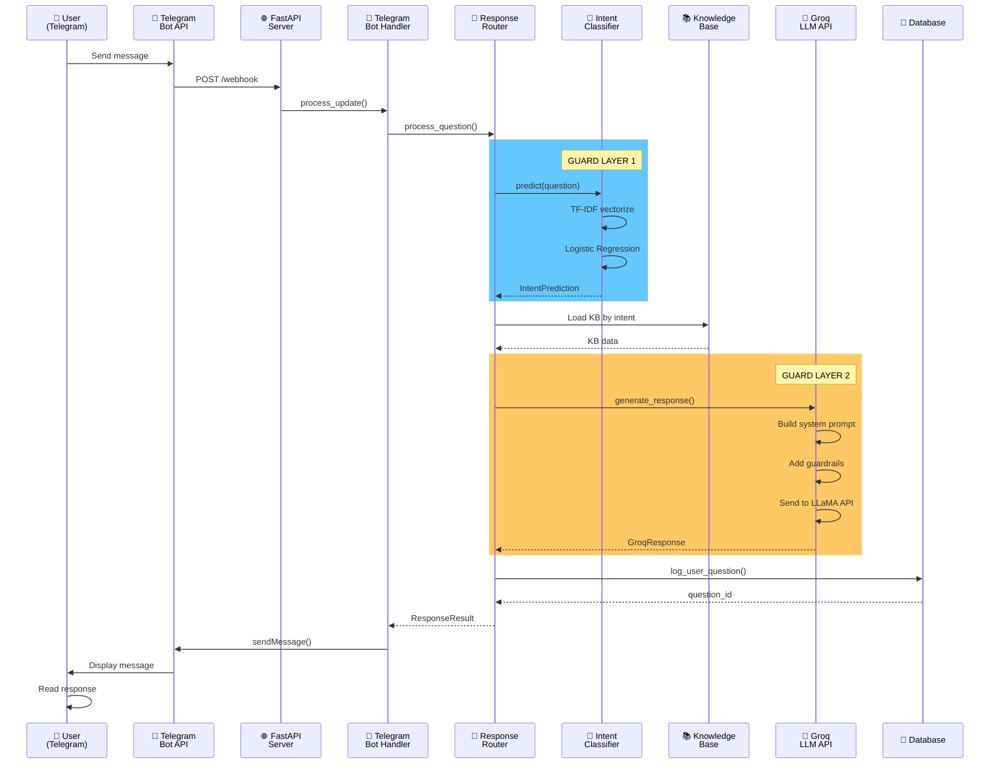

---

## Intent Classification Pipeline

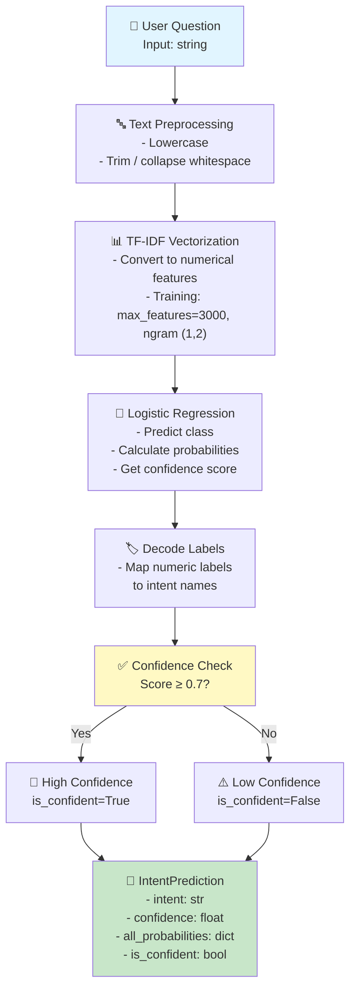

---

## Confidence-Based Response Selection Flow

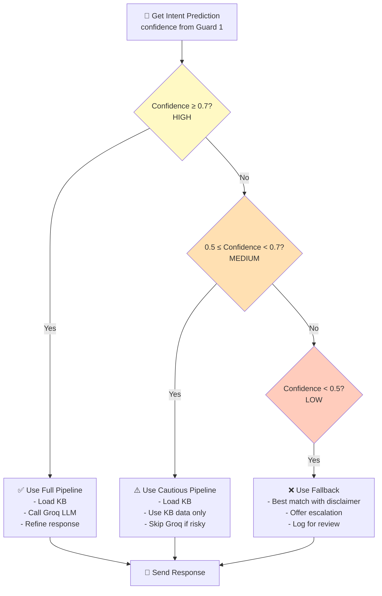

---

## Error Handling & Fallback Strategy

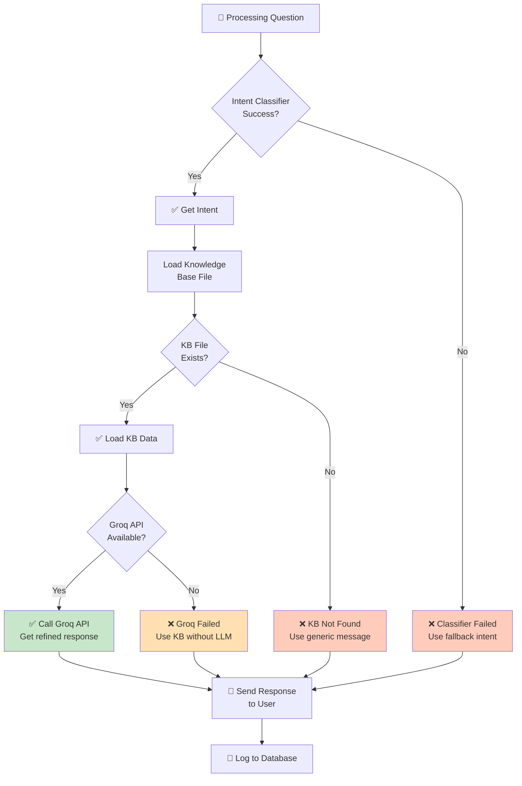

---

## Data Flow: From Question to Database

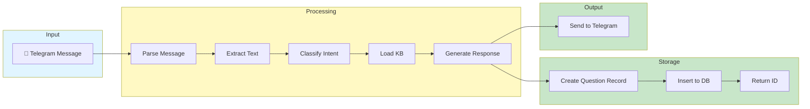

---

## Component Interaction Diagram

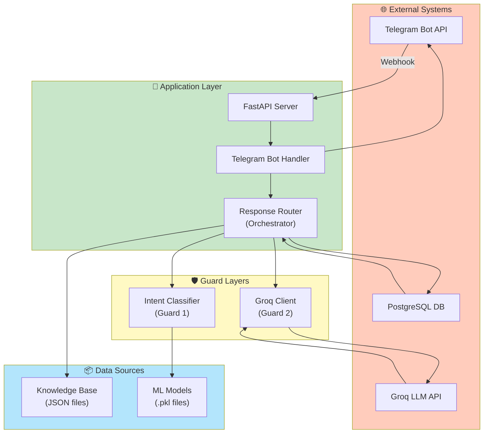

---

## Knowledge Base Loading Process

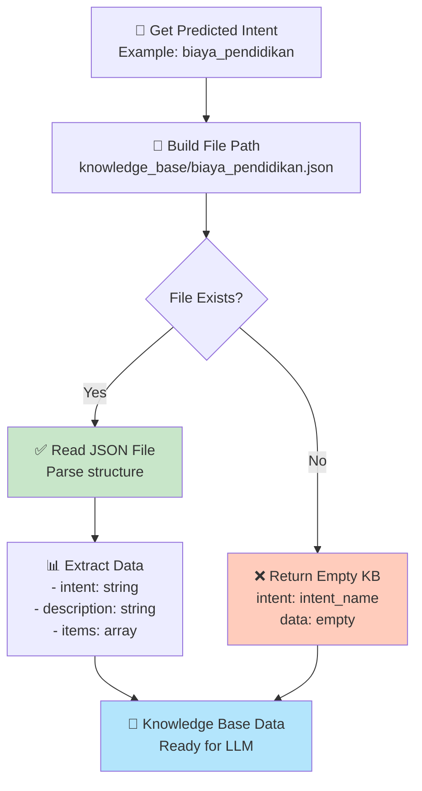

---

## Request Validation & Sanitization Flow

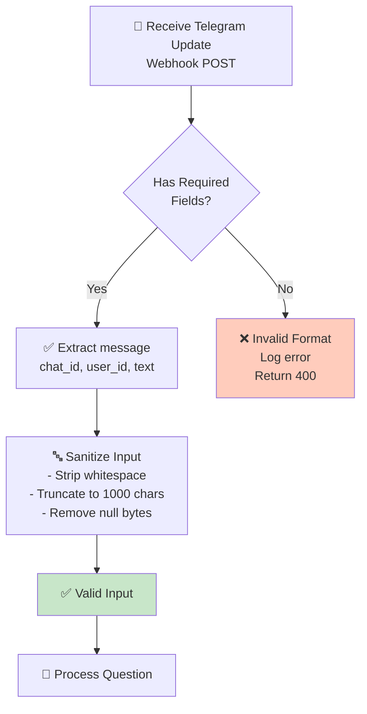

---

## Database Entity Relationships

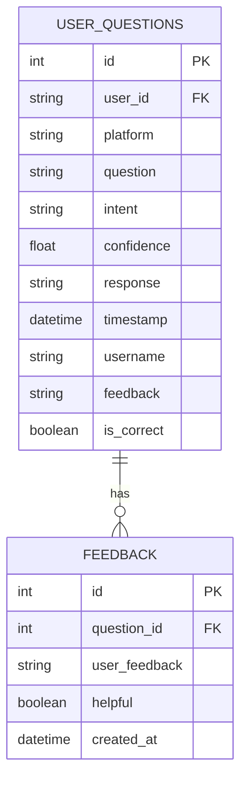

---

## System State & Persistence

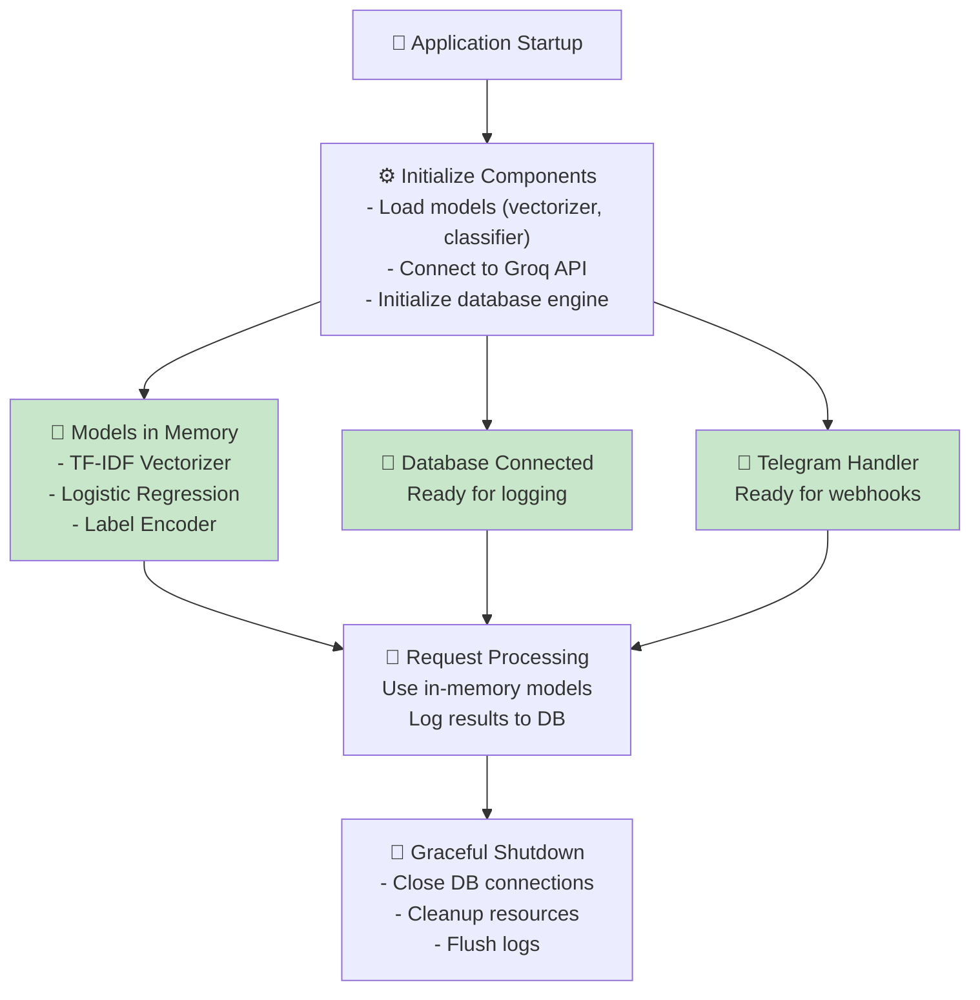

---

## Response Quality Assurance Flow

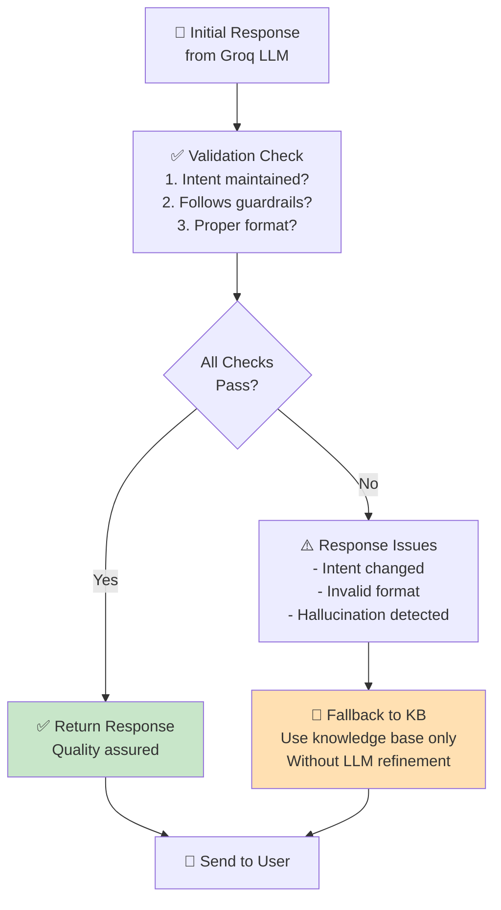

---

## Concurrent Request Handling

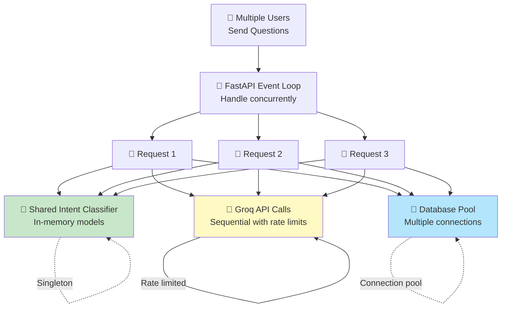

---

## Confidence Score Distribution

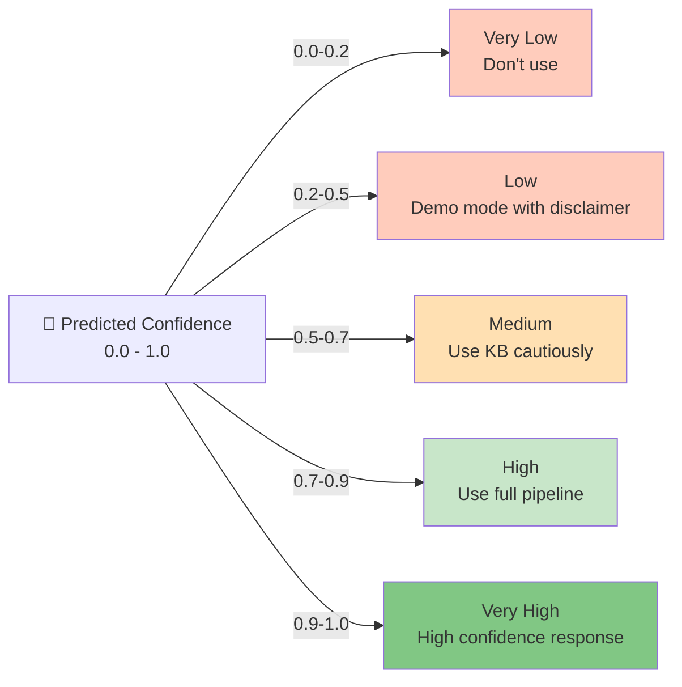

---

## Guardrail Enforcement Points

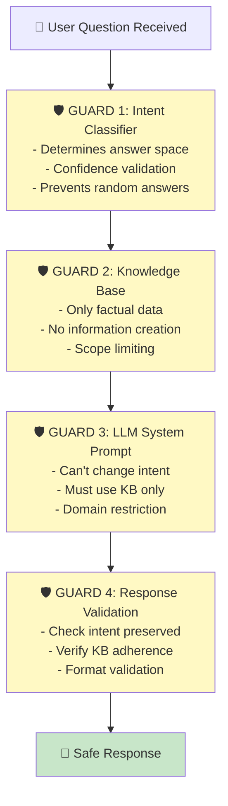

---

## Production Deployment Data Flow

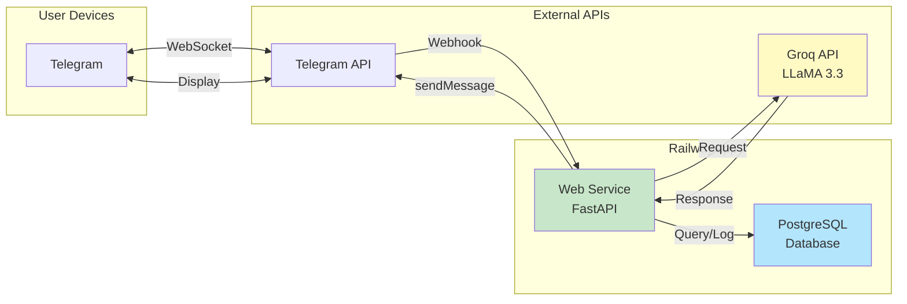

---

**These diagrams show how data flows through the system at different levels of abstraction.**

