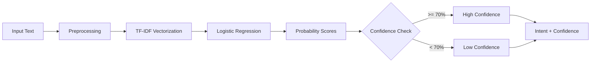

# 🔧 NLP Pipeline - Intent Classification Model

## Overview

Dokumen ini menjelaskan pipeline NLP untuk model **Intent Classification** pada Chatbot PSB. Model ini berfungsi sebagai **Guard Layer 1** dalam Double Guard Architecture.

---

## Pipeline Flow



---

## 1. Preprocessing Steps

Langkah-langkah pembersihan teks sebelum diproses oleh model.

### Training Time (Notebook)

```python
def clean_text(text):
    # 1. Mengubah ke lowercase
    text = text.lower()
    # 2. Menghapus tanda baca dan karakter non-alfabet
    text = re.sub(r'[^a-z\s]', '', text)
    # 3. Menghapus spasi berlebih
    text = re.sub(r'\s+', ' ', text).strip()
    return text
```

### Inference Time (Production)

```python
def _preprocess_text(self, text: str) -> str:
    # 1. Convert to lowercase + strip whitespace
    text = text.lower().strip()
    # 2. Remove extra whitespaces
    text = " ".join(text.split())
    return text
```

| Step | Deskripsi |
|------|-----------|
| **Lowercase** | Semua karakter diubah menjadi huruf kecil |
| **Normalize Whitespace** | Menghapus spasi berlebih (multiple → single) |

Inference produksi (`intent_classifier._preprocess_text`) **tidak** menghapus tanda baca. Penghapusan non-alfabet hanya didokumentasikan untuk langkah training di notebook; pastikan notebook dan inference tetap konsisten saat retraining.

> **Catatan:** Preprocessing sederhana dipilih karena dataset Bahasa Indonesia dan domain PSB yang terbatas. Tidak menggunakan stemming/lemmatization.

---

## 2. Feature Extraction

### TF-IDF Vectorizer

Model menggunakan **TF-IDF (Term Frequency-Inverse Document Frequency)** untuk mengubah teks menjadi representasi numerik.

| Parameter | Nilai | Penjelasan |
|-----------|-------|------------|
| `max_features` | 3000 | Maksimum 3000 fitur (kata/n-gram) |
| `ngram_range` | (1, 2) | Unigram dan bigram |

### Konfigurasi Training

```python
vectorizer = TfidfVectorizer(
    max_features=3000,
    ngram_range=(1, 2)
)

X = vectorizer.fit_transform(df['clean_text'])
```

### Output Dimensi

| Metrik | Nilai |
|--------|-------|
| **Feature Matrix** | (1062, 2096) |
| **Jumlah Samples** | 1.062 |
| **Jumlah Features** | 2.096 |

### Mengapa TF-IDF?

```
┌────────────────────────────────────────────────────────────────┐
│  ✅ KEUNGGULAN TF-IDF untuk Domain Tertutup                    │
├────────────────────────────────────────────────────────────────┤
│  • Ringan dan cepat - cocok untuk real-time inference          │
│  • Tidak butuh GPU atau model besar                            │
│  • Efektif untuk domain terbatas (10 intent PSB)               │
│  • Dapat di-serialize sebagai .pkl file                        │
│  • Explainable - mudah debug kata mana yang penting            │
└────────────────────────────────────────────────────────────────┘
```

---

## 3. Algoritma Klasifikasi Intent

Pipeline NLP yang digunakan bersifat **model-agnostic** pada tahap preprocessing dan feature extraction.

### Representasi Fitur

| Metode | Deskripsi |
|--------|-----------|
| **TF-IDF** | Term Frequency-Inverse Document Frequency untuk representasi numerik teks |

### Algoritma yang Diuji

| Algoritma | Deskripsi |
|-----------|-----------|
| **Logistic Regression** | Model linear untuk multi-class classification dengan output probabilistik |
| **Multinomial Naive Bayes** | Model probabilistik berbasis Bayes untuk klasifikasi teks |

### Catatan Penting

```
┌────────────────────────────────────────────────────────────────┐
│  📝 CATATAN                                                     │
├────────────────────────────────────────────────────────────────┤
│  • Tidak ada perbedaan preprocessing antar model               │
│  • Perbedaan hanya pada algoritma klasifikasi                  │
│  • Kedua model menggunakan TF-IDF vectorizer yang sama         │
│  • Evaluasi detail tersedia di notebook training               │
└────────────────────────────────────────────────────────────────┘
```

> Referensi: `notebooks/intent_classifier_training_executed_v2.ipynb`

---

## 4. Detail Algoritma Model

### Logistic Regression (Multi-class)

Model menggunakan **Logistic Regression** dengan multi-class classification.

| Parameter | Nilai | Penjelasan |
|-----------|-------|------------|
| `max_iter` | 1000 | Maksimum iterasi untuk konvergensi |
| `random_state` | 42 | Seed untuk reproducibility |

### Konfigurasi Training

```python
model = LogisticRegression(
    max_iter=1000,
    random_state=42
)

model.fit(X_train, y_train)
```

### Data Split

| Set | Proporsi | Jumlah Samples |
|-----|----------|----------------|
| **Training** | 80% | ~850 |
| **Testing** | 20% | ~212 |

### Label Encoding

| Index | Intent |
|-------|--------|
| 0 | `biaya_pendidikan` |
| 1 | `eskalasi_admin` |
| 2 | `faq_umum` |
| 3 | `info_pendaftaran` |
| 4 | `kegiatan_harian` |
| 5 | `kirim_dokumen` |
| 6 | `link_formulir` |
| 7 | `pendidikan_formal` |
| 8 | `program_unggulan` |
| 9 | `syarat_pendaftaran` |

### Mengapa Logistic Regression?

1. **Fast Training** - Model dapat dilatih dalam hitungan detik
2. **Probabilistic Output** - Menghasilkan probability untuk setiap class (confidence score)
3. **Interpretable** - Coefficient dapat dianalisis untuk memahami fitur penting
4. **Stable** - Tidak overfitting dengan dataset kecil-medium

---

### Multinomial Naive Bayes (Multi-class)

Model juga menggunakan **Multinomial Naive Bayes** sebagai alternatif untuk klasifikasi teks.

| Parameter | Nilai | Penjelasan |
|-----------|-------|------------|
| `alpha` | 1.0 (default) | Parameter smoothing untuk mencegah probability = 0 |

### Konfigurasi Training

```python
nb_model = MultinomialNB()

nb_model.fit(X_train, y_train)
```

### Cara Kerja Multinomial Naive Bayes

Multinomial Naive Bayes adalah algoritma probabilistik yang didasarkan pada **Teorema Bayes** dengan asumsi "naive" bahwa setiap fitur (kata) bersifat independen satu sama lain.

#### Formula Dasar:

```
P(Class|Text) = P(Text|Class) × P(Class) / P(Text)
```

#### Langkah Prediksi:

1. **Menghitung Prior Probability**: Probabilitas setiap intent muncul dalam data training
   - `P(intent_i) = jumlah_dokumen_intent_i / total_dokumen`

2. **Menghitung Likelihood**: Probabilitas kata muncul dalam intent tertentu
   - `P(kata|intent) = (count_kata_dalam_intent + alpha) / (total_kata_dalam_intent + alpha × vocab_size)`
   - **alpha** digunakan untuk **Laplace Smoothing** mencegah probability = 0 untuk kata yang tidak pernah muncul

3. **Menghitung Posterior**: Mengalikan semua probability untuk mendapat score akhir
   - `P(intent|text) ∝ P(intent) × ∏ P(kata|intent)^count_kata`

4. **Prediksi**: Intent dengan posterior probability tertinggi dipilih

### Mengapa Multinomial Naive Bayes?

1. **Simple & Fast** - Sangat cepat dalam training dan inference
2. **Works Well with Text** - Dirancang khusus untuk data kategorikal seperti teks
3. **Low Memory Footprint** - Hanya menyimpan probability count, efisien untuk deployment
4. **Good Baseline** - Performansi yang solid untuk klasifikasi teks meskipun asumsi "naive"
5. **Probabilistic Output** - Menghasilkan confidence score seperti Logistic Regression

### Kelebihan dan Kekurangan

```
┌────────────────────────────────────────────────────────────────┐
│  ✅ KELEBIHAN                                                   │
├────────────────────────────────────────────────────────────────┤
│  • Training sangat cepat, cocok untuk re-training berkala      │
│  • Performa baik pada dataset kecil-medium                     │
│  • Robust terhadap irrelevant features                        │
│  • Mudah diinterpretasi - melihat kata mana yang penting       │
└────────────────────────────────────────────────────────────────┘

┌────────────────────────────────────────────────────────────────┐
│  ⚠️  KEKURANGAN                                                 │
├────────────────────────────────────────────────────────────────┤
│  • Asumsi independence antar fitur jarang benar di dunia nyata │
│  • Kurang baik menangkap kombinasi kata (n-gram correlation)   │
│  • Probability estimation bias untuk class yang jarang muncul  │
└────────────────────────────────────────────────────────────────┘
```

---

## 5. Output Model

### Model Artifacts

| File | Deskripsi | Lokasi |
|------|-----------|--------|
| `vectorizer_2.pkl` | TF-IDF Vectorizer yang sudah fit | `models/` |
| `lr_intent_model_2.pkl` | Logistic Regression yang sudah dilatih | `models/` (bundle v2) |
| `label_encoder_2.pkl` | Mapping kelas → nama intent | `models/` |

Fallback: `models/v1/intent_model.pkl`, `models/v1/vectorizer.pkl`, `models/v1/label_encoder.pkl`. Mock hanya jika `ALLOW_MOCK_CLASSIFIER=true`.

### Prediction Output

```python
@dataclass
class IntentPrediction:
    intent: str                         # Predicted intent label
    confidence: float                   # Confidence score (0.0 - 1.0)
    all_probabilities: Dict[str, float] # Probability for each intent
    is_confident: bool                  # True if confidence >= threshold
```

### Contoh Output

```python
IntentPrediction(
    intent="biaya_pendidikan",
    confidence=0.92,
    all_probabilities={
        "biaya_pendidikan": 0.92,
        "info_pendaftaran": 0.04,
        "syarat_pendaftaran": 0.02,
        # ... other intents
    },
    is_confident=True
)
```

---

## 6. Confidence Threshold

### Default Threshold

| Threshold | Level | Action |
|-----------|-------|--------|
| **≥ 90%** | `very_high` | Jawab dengan percaya diri |
| **≥ 70%** | `high` | Jawab normal (threshold default) |
| **≥ 50%** | `medium` | Jawab dengan hati-hati, sarankan konfirmasi |
| **≥ 30%** | `low` | Disclaimer + fallback + kontak admin |
| **< 30%** | `very_low` | Fallback ke admin |

### Konfigurasi

```python
# Default confidence threshold
confidence_threshold = 0.7  # 70%

# Confidence level function
def get_confidence_level(confidence: float) -> str:
    if confidence >= 0.9:
        return "very_high"
    elif confidence >= 0.7:
        return "high"
    elif confidence >= 0.5:
        return "medium"
    elif confidence >= 0.3:
        return "low"
    else:
        return "very_low"
```

### Strategi Berdasarkan Confidence

| Level | Strategi LLM |
|-------|--------------|
| `high` / `very_high` | Jawab dengan percaya diri berdasarkan Knowledge Base |
| `medium` | Jawab tapi sarankan konfirmasi ke admin |
| `low` / `very_low` | Awali dengan disclaimer, akhiri dengan kontak admin |

---

## Inference Pipeline (Production)

```python
# 1. Input
text = "Berapa biaya pendidikan per bulan?"

# 2. Preprocess
processed = self._preprocess_text(text)
# Output: "berapa biaya pendidikan per bulan"

# 3. Vectorize
text_vector = self.vectorizer.transform([processed])
# Output: sparse matrix (1, 2096)

# 4. Predict
probabilities = self.model.predict_proba(text_vector)[0]
predicted_idx = np.argmax(probabilities)

# 5. Get intent label
intent = self.label_encoder.inverse_transform([predicted_idx])[0]
# Output: "biaya_pendidikan"

# 6. Get confidence
confidence = float(probabilities[predicted_idx])
# Output: 0.92

# 7. Check threshold
is_confident = confidence >= 0.7
# Output: True
```

---

## Performance Metrics

Model dievaluasi menggunakan metrik standar:

| Metrik | Deskripsi |
|--------|-----------|
| **Accuracy** | Proporsi prediksi yang benar |
| **Precision** | TP / (TP + FP) per class |
| **Recall** | TP / (TP + FN) per class |
| **F1-Score** | Harmonic mean Precision & Recall |

> Evaluasi detail tersedia di notebook: `notebooks/intent_classifier_training_executed_v2.ipynb`

---

*Dokumen ini diperbarui: September 2026*
