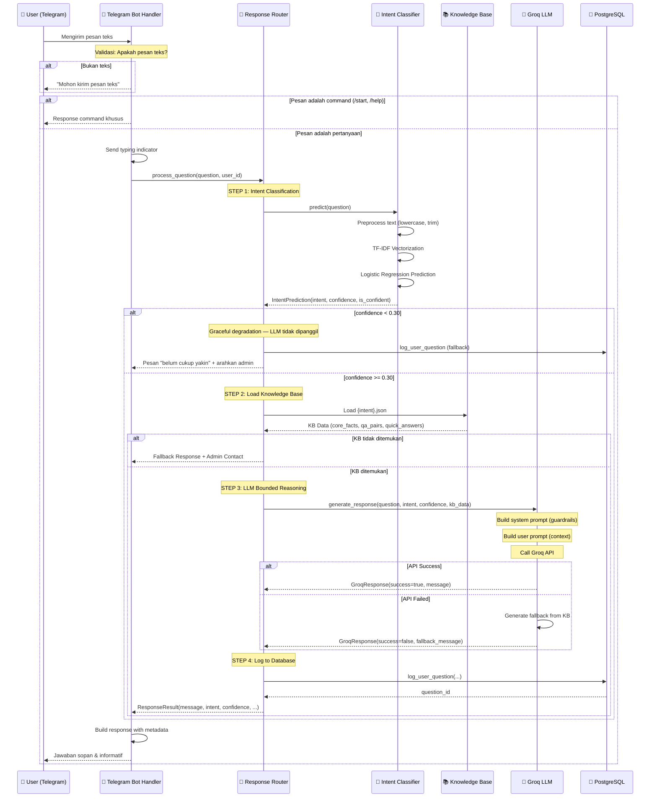

# 🔄 Chatbot PSB - System Flow

Dokumen ini menjelaskan alur kerja sistem chatbot PSB secara detail, termasuk alur request-response, decision tree, dan logika eskalasi.

---

## 📱 Alur Request dari User → Response

### Overview Flow

```
┌─────────────────────────────────────────────────────────────────────────────────────┐
│                              REQUEST → RESPONSE FLOW                                  │
└─────────────────────────────────────────────────────────────────────────────────────┘

       ┌──────────┐     ┌──────────────┐     ┌─────────────┐     ┌─────────────────┐
       │ Telegram │────▶│ Telegram Bot │────▶│   Response  │────▶│ Intent          │
       │ User     │     │ Handler      │     │   Router    │     │ Classifier      │
       └──────────┘     └──────────────┘     └─────────────┘     │ (Guard Layer 1) │
                                                    │             └─────────────────┘
                                                    │                      │
                                                    ▼                      ▼
                                            ┌─────────────┐     ┌─────────────────┐
                                            │ Knowledge   │◀────│ Intent + Score  │
                                            │ Base (JSON) │     │ (0-100%)        │
                                            └─────────────┘     └─────────────────┘
                                                    │
                                                    ▼
                              ┌─────────────────────────────────────────────────────┐
                              │                   GROQ LLM API                       │
                              │               (Guard Layer 2)                        │
                              │                                                      │
                              │  Input:                                              │
                              │  • Question + Intent + Confidence + KB Data          │
                              │                                                      │
                              │  Output:                                             │
                              │  • Natural, polite response (bahasa Indonesia)       │
                              └─────────────────────────────────────────────────────┘
                                                    │
                                                    ▼
                                            ┌─────────────┐
                                            │  Database   │ ← Log untuk analisis
                                            │  Logging    │
                                            └─────────────┘
                                                    │
                                                    ▼
                                            ┌─────────────┐
                                            │  Response   │
                                            │  ke User    │
                                            └─────────────┘
```

---

### Detailed Flow (Step-by-Step)



---

### Component Sequence Table

| Step | Component | Action | Input | Output |
|------|-----------|--------|-------|--------|
| 1 | **Telegram Bot Handler** | Receive & validate message | Telegram Update JSON | Extracted text + chat_id |
| 2 | **Response Router** | Orchestrate pipeline | User question | Final ResponseResult |
| 2.1 | **Intent Classifier** | Classify intent | Preprocessed text | Intent + Confidence (0-1) |
| 2.2 | **Response Router** | Load KB | Intent label | KB JSON data |
| 2.3 | **Groq Client** | Generate response | Question + Intent + KB | Natural language response |
| 2.4 | **Database** | Log question | All metadata | question_id |
| 3 | **Telegram Bot Handler** | Send response | ResponseResult | Telegram message |

---

## 🌳 Pseudo-Flow / Decision Tree

```
START: User mengirim pesan ke Telegram Bot
│
├── [CHECK] Apakah pesan mengandung 'text'?
│   ├── NO ──► Return: "Mohon kirim pesan dalam bentuk teks"
│   │
│   └── YES
│       │
│       ├── [CHECK] Apakah pesan dimulai dengan '/'?
│       │   │
│       │   ├── YES (Command)
│       │   │   ├── /start ──► Return: Welcome message
│       │   │   ├── /help  ──► Return: Help message
│       │   │   ├── /status ──► Return: System status
│       │   │   ├── /about ──► Return: About message
│       │   │   └── other  ──► Return: "Perintah tidak dikenali"
│       │   │
│       │   └── NO (Regular Question)
│       │       │
│       │       ├── [GUARD LAYER 1] Intent Classification
│       │       │   │
│       │       │   ├── Preprocess: lowercase, trim whitespace (tanpa hapus tanda baca)
│       │       │   ├── Vectorize: TF-IDF transform
│       │       │   ├── Predict: Logistic Regression
│       │       │   │
│       │       │   └── Output: (intent, confidence, is_confident)
│       │       │
│       │       ├── [CHECK] confidence < 0.30?
│       │       │   ├── YES ──► Fallback aman, TANPA load KB, TANPA Groq
│       │       │   └── NO
│       │       │
│       │       ├── [CHECK] Apakah file KB untuk intent ada?
│       │       │   │
│       │       │   ├── NO ──► Return: "Informasi belum tersedia" + Admin Contact
│       │       │   │
│       │       │   └── YES
│       │       │       │
│       │       │       ├── Load KB Data dari {intent}.json
│       │       │       │
│       │       │       ├── [GUARD LAYER 2] LLM Bounded Reasoning
│       │       │       │   │
│       │       │       │   ├── [CHECK] Confidence (instruksi GroqClient)
│       │       │       │   │   ├── < 0.5 (LOW)
│       │       │       │   │   │   └── Disclaimer + cek relevansi intent
│       │       │       │   │   ├── 0.5-0.7 (MEDIUM)
│       │       │       │   │   │   └── Jawab hati-hati + saran konfirmasi
│       │       │       │   │   └── >= 0.7 (HIGH)
│       │       │       │   │       └── Jawab dengan percaya diri
│       │       │       │   │
│       │       │       │   ├── Build System Prompt (guardrails)
│       │       │       │   ├── Build User Prompt (context + KB)
│       │       │       │   │
│       │       │       │   ├── [CHECK] API Call Success?
│       │       │       │   │   │
│       │       │       │   │   ├── YES ──► Use LLM Response
│       │       │       │   │   │
│       │       │       │   │   └── NO (Timeout/Error)
│       │       │       │   │       └── Generate Fallback from KB directly
│       │       │       │   │
│       │       │       │   └── Output: GroqResponse(message, success)
│       │       │       │
│       │       │       ├── Log to Database (async, non-blocking)
│       │       │       │
│       │       │       └── Build Final Response
│       │       │           │
│       │       │           ├── [CHECK] Confidence Level
│       │       │           │   ├── LOW/VERY_LOW ──► Add confidence note
│       │       │           │   └── HIGH ──► No additional note
│       │       │           │
│       │       │           ├── [CHECK] Environment == development?
│       │       │           │   ├── YES ──► Add debug info
│       │       │           │   └── NO ──► Skip debug
│       │       │           │
│       │       │           └── Return: Final Message to User
│
END: Response dikirim ke Telegram
```

---

## 📞 Escalation Logic

### Kapan Eskalasi Terjadi

Sistem akan melakukan eskalasi ke admin dalam kondisi berikut:

```
┌─────────────────────────────────────────────────────────────────────────────────────┐
│                              ESCALATION TRIGGERS                                     │
└─────────────────────────────────────────────────────────────────────────────────────┘

┌───────────────────────────────────────────────────────────────────────────────────┐
│ TRIGGER 1: Knowledge Base Tidak Tersedia                                          │
├───────────────────────────────────────────────────────────────────────────────────┤
│ Kondisi  : File {intent}.json tidak ditemukan                                     │
│ Response : "Informasi untuk topik '{intent}' belum tersedia dalam sistem.         │
│            Silakan hubungi admin untuk informasi lebih lanjut."                   │
│ Action   : Sertakan kontak admin                                                  │
└───────────────────────────────────────────────────────────────────────────────────┘

┌───────────────────────────────────────────────────────────────────────────────────┐
│ TRIGGER 2: Confidence sangat rendah (< 30%)                                       │
├───────────────────────────────────────────────────────────────────────────────────┤
│ Kondisi  : Intent Classifier confidence < 0.30 (response_router)                  │
│ Response : Tidak memanggil Groq. Pesan "belum cukup yakin" + arahkan admin.       │
│ Catatan  : Pada 0.30–0.70 Groq tetap dipanggil dengan instruksi hati-hati.        │
│            Instruksi Groq membedakan <0.50, 0.50–0.70, dan ≥0.70.               │
└───────────────────────────────────────────────────────────────────────────────────┘

┌───────────────────────────────────────────────────────────────────────────────────┐
│ TRIGGER 3: Intent "eskalasi_admin"                                                │
├───────────────────────────────────────────────────────────────────────────────────┤
│ Kondisi  : User secara eksplisit ingin bicara dengan admin                        │
│ Trigger  : "hubungi admin", "bicara dengan admin", "operator"                     │
│ Response : Tampilkan daftar kontak admin lengkap                                  │
│ KB File  : eskalasi_admin.json                                                    │
└───────────────────────────────────────────────────────────────────────────────────┘

┌───────────────────────────────────────────────────────────────────────────────────┐
│ TRIGGER 4: Intent "syariah_guard"                                                 │
├───────────────────────────────────────────────────────────────────────────────────┤
│ Kondisi  : Pertanyaan mengandung topik tidak sesuai syariat atau di luar PSB      │
│ Trigger  : Topik sensitif (lihat daftar di KB)                                    │
│ Response : "Maaf, topik ini tidak sesuai layanan PSB" + kontak admin              │
│ KB File  : syariah_guard.json                                                     │
└───────────────────────────────────────────────────────────────────────────────────┘

┌───────────────────────────────────────────────────────────────────────────────────┐
│ TRIGGER 5: API Groq Gagal                                                         │
├───────────────────────────────────────────────────────────────────────────────────┤
│ Kondisi  : Timeout atau error saat call Groq API                                  │
│ Response : Fallback response dari KB langsung                                     │
│ Action   : Tambahkan pesan error + saran hubungi admin                            │
└───────────────────────────────────────────────────────────────────────────────────┘

┌───────────────────────────────────────────────────────────────────────────────────┐
│ TRIGGER 6: System Error                                                           │
├───────────────────────────────────────────────────────────────────────────────────┤
│ Kondisi  : Exception tidak terduga dalam pipeline                                 │
│ Response : "Mohon maaf, terjadi kesalahan. Silakan coba lagi atau hubungi admin." │
│ Action   : Log error untuk debugging                                              │
└───────────────────────────────────────────────────────────────────────────────────┘
```

---

### Escalation Flow Diagram

```
                                    USER QUESTION
                                         │
                                         ▼
                              ┌─────────────────────┐
                              │  Intent Classifier  │
                              │  (Guard Layer 1)    │
                              └────────┬────────────┘
                                       │
                    ┌──────────────────┼──────────────────┐
                    │                  │                  │
                    ▼                  ▼                  ▼
           ┌───────────────┐  ┌───────────────┐  ┌───────────────┐
           │ eskalasi_admin│  │ syariah_guard │  │  Normal PSB   │
           │   (Direct)    │  │   (Block)     │  │   Intent      │
           └───────┬───────┘  └───────┬───────┘  └───────┬───────┘
                   │                  │                  │
                   ▼                  ▼                  ▼
           ┌───────────────┐  ┌───────────────┐  ┌───────────────┐
           │ Tampilkan     │  │ Block dengan  │  │ Check         │
           │ Kontak Admin  │  │ pesan tolak + │  │ Confidence    │
           │               │  │ kontak admin  │  │ Score         │
           └───────────────┘  └───────────────┘  └───────┬───────┘
                                                          │
                                    ┌─────────────────────┼─────────────────────┐
                                    │                     │                     │
                                    ▼                     ▼                     ▼
                            ┌───────────────┐     ┌───────────────┐     ┌───────────────┐
                            │ Confidence    │     │ Confidence    │     │ Confidence    │
                            │ < 50%         │     │ 50% - 70%     │     │ >= 70%        │
                            │ (Very Low)    │     │ (Medium)      │     │ (High)        │
                            └───────┬───────┘     └───────┬───────┘     └───────┬───────┘
                                    │                     │                     │
                                    ▼                     ▼                     ▼
                            ┌───────────────┐     ┌───────────────┐     ┌───────────────┐
                            │ + Disclaimer  │     │ + Saran       │     │ Jawab         │
                            │ + Strong      │     │   konfirmasi  │     │ dengan        │
                            │   escalation  │     │   ke admin    │     │ percaya diri  │
                            └───────────────┘     └───────────────┘     └───────────────┘
```

---

### Informasi Kontak Admin (Escalation Targets)

| Departemen | Kontak | Jam Operasional |
|------------|--------|-----------------|
| **Pendaftaran_calon_santri** | WA: 0812-3456-7890 (Ustadz Dian Amarullah) | Senin-Jumat 08:00-15:00 WIB |
| **Pendaftaran_calon_santriah** | WA: 0812-3456-7890 (Ustadz Siti Azizah) | Senin-Jumat 08:00-15:00 WIB |
| **Kantor** | Telepon: (0274) 123-4567 | Senin-Jumat 08:00-16:00 WIB |


---

### Escalation Message Templates

```
┌─────────────────────────────────────────────────────────────────────────────────────┐
│ Template 1: Low Confidence Escalation                                               │
├─────────────────────────────────────────────────────────────────────────────────────┤
│ "Berdasarkan pemahaman saya terhadap pertanyaan Anda...                            │
│  [JAWABAN DARI KB]                                                                  │
│                                                                                     │
│  Untuk memastikan informasi lebih akurat, silakan konfirmasi dengan admin kami:    │
│  📧 Email: info@ponpesalfalah.com                                                  │
│  📱 WhatsApp: 0812-3456-7890"                                                      │
└─────────────────────────────────────────────────────────────────────────────────────┘

┌─────────────────────────────────────────────────────────────────────────────────────┐
│ Template 2: KB Not Found Escalation                                                 │
├─────────────────────────────────────────────────────────────────────────────────────┤
│ "Mohon maaf, informasi untuk topik '[INTENT]' belum tersedia dalam sistem.         │
│  Silakan hubungi admin untuk informasi lebih lanjut.                               │
│                                                                                     │
│  📧 Kontak Admin: [info@pesantren.example.com]"                                    │
└─────────────────────────────────────────────────────────────────────────────────────┘

┌─────────────────────────────────────────────────────────────────────────────────────┐
│ Template 3: Syariah Guard Escalation                                                │
├─────────────────────────────────────────────────────────────────────────────────────┤
│ "Maaf, pertanyaan Anda mengandung topik yang tidak sesuai dengan nilai-nilai       │
│  Islam dan pondok pesantren.                                                        │
│                                                                                     │
│  🕌 Pondok Pesantren Gemayasih berkomitmen menjaga lingkungan islami dan edukatif.  │
│                                                                                     │
│  Silakan tanyakan tentang:                                                          │
│  ✅ Pendaftaran santri                                                              │
│  ✅ Program pendidikan                                                              │
│  ✅ Biaya                                                             │
│  ✅ Fasilitas pondok                                                                │
│                                                                                     │
│  Atau hubungi admin: 0812-3456-7890"                                               │
└─────────────────────────────────────────────────────────────────────────────────────┘

┌─────────────────────────────────────────────────────────────────────────────────────┐
│ Template 4: System Error Escalation                                                 │
├─────────────────────────────────────────────────────────────────────────────────────┤
│ "Mohon maaf, terjadi kesalahan: [ERROR_MESSAGE]                                    │
│                                                                                     │
│  Silakan coba lagi atau hubungi admin."                                            │
└─────────────────────────────────────────────────────────────────────────────────────┘
```

---

## 📊 Confidence Level Reference

| Level | Range | Behavior | Escalation |
|-------|-------|----------|------------|
| **very_high** | ≥ 90% | Jawab percaya diri | None |
| **high** | ≥ 70% | Jawab percaya diri | None |
| **medium** | ≥ 50% | Jawab dengan hati-hati | Soft (saran konfirmasi) |
| **low** | ≥ 30% | Jawab dengan disclaimer | Moderate (kontak admin) |
| **very_low** | < 30% | Fallback response | Strong (arahkan ke admin) |

---

## 🔐 Guard Layer Constraints

### Guard Layer 1 (Intent Classifier)

```
TANGGUNG JAWAB:
✅ Menentukan intent/topik dari pertanyaan
✅ Menghasilkan confidence score
✅ Membatasi konteks jawaban ke KB yang relevan
✅ SELALU berjalan PERTAMA sebelum LLM

BATASAN:
❌ Tidak bisa menjawab langsung (hanya klasifikasi)
❌ Tidak bisa menambah informasi baru
```

### Guard Layer 2 (LLM Bounded Reasoning)

```
TANGGUNG JAWAB:
✅ Menyusun jawaban natural dari KB
✅ Memperbaiki bahasa agar sopan dan ramah
✅ Mengikuti instruksi confidence-aware

BATASAN KETAT:
❌ TIDAK BOLEH mengubah intent yang diprediksi
❌ TIDAK BOLEH menambah informasi di luar KB
❌ TIDAK BOLEH menjawab di luar topik PSB
❌ TIDAK BOLEH bertindak sebagai decision maker utama
```

---

## 🔄 Fallback Mechanisms

```
┌─────────────────────────────────────────────────────────────────────────────────────┐
│                              GRACEFUL DEGRADATION                                    │
└─────────────────────────────────────────────────────────────────────────────────────┘

Level 1: Normal Flow
├── Intent Classifier → KB → Groq LLM → Natural Response
│
Level 2: LLM Failure
├── Intent Classifier → KB → [Groq Timeout/Error]
│   └── Fallback: Return KB data directly as response
│       + Warning: "Sistem kurang yakin (confidence: X%)"
│
Level 3: KB Not Found
├── Intent Classifier → [KB Missing]
│   └── Fallback: Generic message + Admin contact
│
Level 4: Classifier Failure
├── [Model Error]
│   └── Fallback: Return intent="faq_umum", confidence=0.0
│       + Route to generic FAQ or admin
│
Level 5: System Error
└── [Unexpected Exception]
    └── Fallback: Error message + Admin contact
        + Log error for debugging
```

---

*Dokumen ini diperbarui: September 2026*
