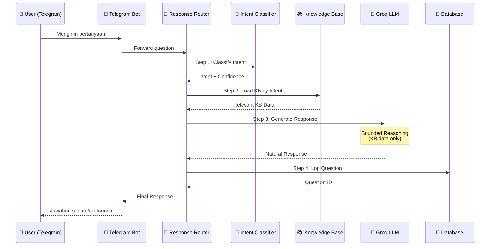

# 🌙 Chatbot PSB - System Overview

## Deskripsi Singkat

**Chatbot PSB** adalah chatbot pintar untuk **Penerimaan Santri Baru (PSB) Pondok Pesantren**. Chatbot ini dirancang untuk menjawab pertanyaan calon santri dan orang tua secara otomatis melalui Telegram dengan bahasa yang sopan, natural, dan informatif.

---

## Tujuan Sistem

1. **Otomasi Layanan Informasi** - Menjawab pertanyaan seputar pendaftaran santri baru secara 24/7
2. **Konsistensi Jawaban** - Memastikan informasi yang diberikan selalu akurat dan konsisten berdasarkan Knowledge Base resmi
3. **Pengalaman Pengguna** - Memberikan respons yang sopan, ramah, dan mudah dipahami
4. **Efisiensi Admin** - Mengurangi beban kerja admin dalam menjawab pertanyaan berulang

---

## Platform

| Platform | Protokol | Status |
|----------|----------|--------|
| **Telegram** | Bot API (Webhook/Polling) | ✅ Aktif |

---

## Arsitektur: Double Guard Architecture

```
┌─────────────────────────────────────────────────────────────────────────────┐
│                           DOUBLE GUARD ARCHITECTURE                         │
└─────────────────────────────────────────────────────────────────────────────┘

┌──────────┐     ┌─────────────────────┐     ┌─────────────────────┐
│ Telegram │────▶│   GUARD LAYER 1     │────▶│   GUARD LAYER 2     │
│   User   │     │ Intent Classifier   │     │   LLM (Groq API)    │
└──────────┘     │   (TF-IDF + LogReg) │     │  Bounded Reasoning  │
                 └─────────────────────┘     └─────────────────────┘
                           │                           │
                           ▼                           ▼
                 ┌─────────────────────┐     ┌─────────────────────┐
                 │   Knowledge Base    │     │   Final Response    │
                 │   (JSON Files)      │◀────│   (Natural, Polite) │
                 └─────────────────────┘     └─────────────────────┘
```

### Guard Layer 1: Intent Classification

**Tugas:** Menentukan konteks/topik dari pertanyaan pengguna.

Guard pertama pada arsitektur Double Guard
menggunakan satu model klasifikasi intent ( Logistic Regression)
yang dipilih berdasarkan hasil evaluasi
dari beberapa algoritma yang diuji.

- **Algoritma:** TF-IDF + Logistic Regression (scikit-learn)
- **Role:** PRIMARY decision maker - selalu berjalan PERTAMA
- **Output:** Intent label + Confidence score (0-100%)
- **File:** `intent_classifier.py`

### Guard Layer 2: LLM Bounded Reasoning

**Tugas:** Menyusun jawaban natural dari Knowledge Base dengan bahasa sopan.

- **Model:** Groq API (LLaMA 3.3 70B Versatile)
- **Role:** Language refinement ONLY - bukan decision maker
- **Constraints:**
  - ❌ TIDAK BOLEH mengubah intent
  - ❌ TIDAK BOLEH menambah informasi baru
  - ❌ TIDAK BOLEH menjawab di luar topik PSB
- **File:** `groq_client.py`

---

## End-to-End Flow



---

## Komponen Utama

### 1. Intent Classification Model
| Aspek | Detail |
|-------|--------|
| **Algoritma** | TF-IDF Vectorizer + Logistic Regression |
| **Framework** | scikit-learn |
| **Model Files** | `vectorizer_2.pkl`, `intent_model_2.pkl`, `label_encoder_2.pkl` |
| **Lokasi** | `models/` |
| **Intents** | `info_pendaftaran`, `syarat_pendaftaran`, `biaya_pendidikan`, `program_unggulan`, `faq_umum`, `eskalasi_admin`,  `kegiatan_harian`, `kirim_dokumen`, `link_formulir`, `pendidikan_formal`, `syariah_guard`|

### 2. LLM (Groq API)
| Aspek | Detail |
|-------|--------|
| **Provider** | Groq Cloud |
| **Model** | `llama-3.3-70b-versatile` |
| **Role** | Language refinement, bounded reasoning |
| **Temperature** | 0.3 (low creativity, high accuracy) |
| **Max Tokens** | 500 |

### 3. Knowledge Base
| Aspek | Detail |
|-------|--------|
| **Format** | JSON files dengan `core_facts`, `qa_pairs`, `quick_answers` |
| **Lokasi** | `knowledge_base/` |
| **Jumlah Domain** | 11 topik PSB |

### 4. Response Router
| Aspek | Detail |
|-------|--------|
| **File** | `response_router.py` |
| **Role** | Orchestrator utama - menghubungkan semua komponen |

### 5. Telegram Bot
| Aspek | Detail |
|-------|--------|
| **File** | `telegram_bot.py` (webhook), `app_polling.py` (polling) |
| **Framework** | python-telegram-bot |

### 6. Database
| Aspek | Detail |
|-------|--------|
| **ORM** | SQLAlchemy |
| **Database** | PostgreSQL |
| **Tujuan** | Logging user questions untuk analisis & retraining |

---

## ❌ Yang TIDAK Digunakan

| Teknologi | Alasan Tidak Digunakan |
|-----------|----------------------|
| **RAG (Retrieval-Augmented Generation)** | Knowledge Base sudah terstruktur per-intent, tidak perlu semantic search. Intent Classifier sudah menentukan KB mana yang relevan. |
| **Vector Database** | Tidak diperlukan karena tidak menggunakan RAG/embedding-based retrieval. |
| **Embedding Models** | TF-IDF sudah cukup efektif untuk domain tertutup (PSB). |

---

## Mengapa Double Guard Architecture?

```
┌────────────────────────────────────────────────────────────────────┐
│  ✅ KEUNGGULAN DOUBLE GUARD vs SINGLE LLM                         │
├────────────────────────────────────────────────────────────────────┤
│  • Akurasi Tinggi: Intent Classifier membatasi konteks            │
│  • Kontrol Ketat: LLM hanya refine bahasa, bukan decision making  │
│  • Hemat Token: KB sudah difilter berdasarkan intent              │
│  • Konsisten: Jawaban selalu berdasarkan KB resmi                 │
│  • Graceful Degradation: Fallback jika LLM gagal                  │
└────────────────────────────────────────────────────────────────────┘
```

---

## File Structure

```
chatbot-psb/
├── app.py                    # Main app (webhook mode)
├── app_polling.py            # Polling mode for local dev
├── response_router.py        # Core orchestrator
├── intent_classifier.py      # Guard Layer 1
├── groq_client.py            # Guard Layer 2
├── telegram_bot.py           # Telegram handler
├── database.py               # PostgreSQL connection
├── knowledge_base/           # JSON KB files
│   ├── info_pendaftaran.json
│   ├── biaya_pendidikan.json
│   └── ... (11 files)
├── models/                   # ML model files
│   ├── vectorizer_2.pkl
│   ├── intent_model_2.pkl
│   └── label_encoder_2.pkl
└── data/                     # Training data
```

---

*Dokumen ini diperbarui: 3 Januari 2026*
