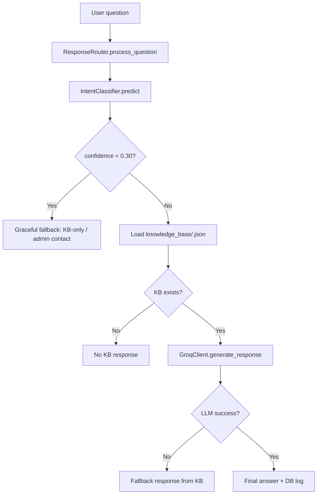

# Dokumentasi Codebase Chatbot PSB

## 1. Ringkasan sistem

Aplikasi ini adalah chatbot PSB berbasis intent classification dan bounded reasoning dengan arsitektur yang disebut Double Guard.

Secara umum, aliran data adalah:

1. User mengirim pertanyaan melalui Telegram atau endpoint webhook.
2. `ResponseRouter` menerima pertanyaan dan menjalankan Guard 1.
3. `IntentClassifier` memprediksi intent dan skor kepercayaan.
4. Router memilih jalur eksekusi: normal flow, fallback rendah, atau gagal aman.
5. Jika masuk jalur normal, router memuat knowledge base yang relevan.
6. `GroqClient` mengeksekusi bounded reasoning untuk memperhalus jawaban berdasarkan KB.
7. Jika Groq gagal atau confidence terlalu rendah, sistem kembali ke mode KB-only dan mengarahkan pengguna ke admin.

---

## 2. Arsitektur Double Guard

### Guard 1: Intent Classifier

Lokasi utama:
- `intent_classifier.py`

Fungsi:
- Mengubah pertanyaan user menjadi intent tertentu, misalnya `biaya_pendidikan`, `syarat_pendaftaran`, atau `faq_umum`.
- Menghasilkan `confidence` numerik.
- Menjadi pengendali konteks utama sebelum LLM dipanggil.

Teknik yang dipakai:
- TF-IDF untuk vectorisasi teks.
- Logistic Regression untuk klasifikasi multi-class.
- Model pre-trained diletakkan dalam folder `models/` dan dibaca saat startup.

Aturan penting:
- Klasifikasi selalu dijalankan terlebih dahulu.
- Model tidak boleh silently fallback menjadi prediksi acak; jika model tidak valid, aplikasi akan membuang error eksplisit kecuali `ALLOW_MOCK_CLASSIFIER=true` aktif untuk mode demo.
- `CONFIDENCE_THRESHOLD = 0.70` digunakan sebagai ambang klasifikasi yang dianggap “high confidence”.

Konsep confidence yang dipakai project:
- `>= 0.70` = high
- `0.50 - < 0.70` = medium
- `0.30 - < 0.50` = low
- `< 0.30` = very_low

### Guard 2: Groq API Client

Lokasi utama:
- `groq_client.py`

Fungsi:
- Menerima pertanyaan, intent, confidence, dan knowledge base.
- Menyusun prompt yang dibatasi (bounded reasoning).
- Menyempurnakan bahasa jawaban agar formal-islami.
- Tidak diperbolehkan mengubah intent atau menambahkan fakta di luar KB.

Aturan sistem prompt yang sangat ketat:
- Hanya boleh memakai informasi dari knowledge base.
- Tidak boleh menambah asumsi baru.
- Tidak boleh mengganti intent yang sudah diprediksi.
- Harus menjawab hanya seputar PSB pesantren.
- Jika data tidak tersedia, harus jujur dan mengarahkan ke admin.

Karena itu, Groq berperan sebagai layer polishing/penyusun bahasa, bukan sebagai pengambil keputusan utama.

### Response Router: orchestrator utama

Lokasi utama:
- `response_router.py`

Fungsi:
- Mengarahkan seluruh pipeline.
- Memanggil classifier terlebih dahulu.
- Memuat KB relevante berdasarkan intent.
- Menilai apakah perlu menjalankan LLM atau berhenti ke fallback.
- Menangani logging ke database dan menghasilkan `ResponseResult`.

Ini adalah “otak” sistem: router memutuskan apakah flow normal atau degraded.

---

## 3. Alur eksekusi pipeline

### Penjelasan jalur utama

1. `ResponseRouter.process_question()` mengecek pertanyaan kosong.
2. `IntentClassifier.predict()` memproduksi intent dan skor confidence.
3. Jika confidence di bawah `RUNTIME_FALLBACK_THRESHOLD = 0.30`, router langsung memanggil `_get_low_confidence_response()`.
4. Jika confidence cukup, router mengambil knowledge base untuk intent yang dipilih.
5. `GroqClient.generate_response()` membangun system prompt + user prompt dengan KB.
6. Jika Groq gagal, `GroqClient._generate_fallback_response()` menghasilkan versi aman berbasis KB.
7. Hasil akhir dikirim ke database untuk audit dan analisis graceful degradation.

---

## 4. Mekanisme graceful degradation

Project ini menerapkan graceful degradation sebagai mekanisme “turun ke mode aman” saat sistem tidak yakin atau dependency gagal.

### 4.1 Degradasi berdasarkan confidence rendah

Di `response_router.py`, ada threshold runtime:

- `RUNTIME_FALLBACK_THRESHOLD = 0.30`

Logika:

- `confidence < 0.30` => hard stop, tidak lanjut ke Groq.
- `0.30 <= confidence < 0.70` => tetap lanjut, tetapi respons dibuat hati-hati dan diberi disclaimers.
- `>= 0.70` => normal flow.

Ketika confidence terlalu rendah, router mengembalikan pesan seperti:
- “Saya belum cukup yakin memahami pertanyaan Anda.”
- Menyediakan kontak admin.
- Meminta pertanyaan yang lebih spesifik.

Ini adalah bentuk graceful degradation yang paling penting karena mencegah keputusan berbahaya di saat model tidak yakin.

### 4.2 Fallback saat knowledge base tidak ada

Jika `intent` diprediksi valid tetapi file KB tidak ditemukan:

- `ResponseRouter._get_no_kb_response()` dipanggil.
- Aplikasi mengembalikan pesan aman bahwa informasi belum tersedia.
- Router tetap mencatat status fallback.

### 4.3 Fallback saat Groq API gagal

Pada `groq_client.py`, `generate_response()` menangkap:
- `httpx.TimeoutException`
- `httpx.HTTPError`
- error yang tidak terduga

Saat itu, sistem tidak menampilkan error mentah ke user. Sebaliknya, dipanggil:
- `GroqClient._generate_fallback_response()`

Respons fallback dibuat dari KB yang sudah dimuat, misalnya:
- “Mohon maaf, layanan AI sedang mengalami gangguan sementara.”
- Menampilkan informasi KB yang relevan.
- Menambahkan catatan bahwa user dapat menghubungi admin jika perlu.

### 4.4 Fallback saat LLM mengembalikan jawaban kosong

Jika content dari Groq kosong, `generate_response()` membuang fallback instead of marking success.

Artinya:
- Respons kosong tidak dianggap berhasil.
- Sistem menurunkan kualitas layanan ke mode aman tanpa crash.

### 4.5 Fallback dalam error umum aplikasi

`ResponseRouter._get_error_response()` menangkap error sistem umum dan mengembalikan respon aman seperti:
- “Mohon maaf, terjadi kesalahan.”
- Arahkan ke admin atau coba ulang.

---

## 5. Prinsip keamanan dan batasan

### Double Guard bukan sekadar redundancy

Sistem tidak hanya punya backup; ia punya dua lapisan keputusan yang berbeda:

1. Lapisan pertama memilih konteks dengan model klasifikasi.
2. Lapisan kedua menyusun jawaban dengan LLM terbatas oleh KB.

Dengan pola ini:
- LLM tidak memimpin keputusan utama.
- Klasifikasi tetap menjadi gate masuk.
- Informasi tetap bersumber dari knowledge base.

### Aturan praktis yang diimplementasikan

- KB adalah single source of truth.
- Classifier menentukan topik, bukan LLM.
- LLM hanya meringkas dan menata ulang fakta yang sudah ada.
- Jika confidence terlalu rendah, sistem tidak memaksa jawaban.
- Jika dependency gagal, sistem masih dapat menjawab berbasis KB.

---

## 6. Struktur file yang relevan

Berikut komponen utama dan peran masing-masing:

- `app.py`: entry point FastAPI, startup validation, webhook, health check.
- `response_router.py`: orchestrator pipeline utama dan fallback logic.
- `intent_classifier.py`: Guard 1, klasifikasi intent dan confidence.
- `groq_client.py`: Guard 2, LLM bounded reasoning dan fallback KB-only.
- `database.py`: logging interaksi user, metrik graceful degradation, dan data statistik.
- `knowledge_base/`: sumber data jawaban yang sebenarnya.
- `tests/test_graceful_degradation.py`: pengujian perilaku fallback dan threshold.

---

## 7. Prinsip operasional graceful degradation yang terukur

Project ini juga menyimpan statistik fallback ke database. Fungsi seperti `get_graceful_degradation_stats()` digunakan untuk menjawab pertanyaan seperti:
- Berapa persen query yang masuk fallback?
- Berapa query dengan confidence sangat rendah?
- Berapa banyak respon yang bisa berjalan dengan LLM normal?

Tujuannya bukan hanya meminta aman, tetapi juga mengumpulkan data untuk evaluasi kualitas model dan laporan penelitian/skripsi.

---

## 8. Kesimpulan

Arsitektur ini dirancang untuk memadukan dua hal yang sering bertentangan dalam chatbot domain spesifik:

- akurasi melalui intent-based routing dan KB grounding,
- keamanan dan kelangsungan layanan melalui graceful degradation.

Dalam praktiknya:
- Guard 1 mencegah konteks yang salah.
- Guard 2 membatasi kreativitas LLM.
- Router menurunkan layanan ke mode aman saat confidence atau dependency tidak valid.

Hasilnya, aplikasi tetap bisa menjawab dengan aman, konsisten, dan lebih tahan terhadap kegagalan dibandingkan chatbot yang mengandalkan LLM saja.
